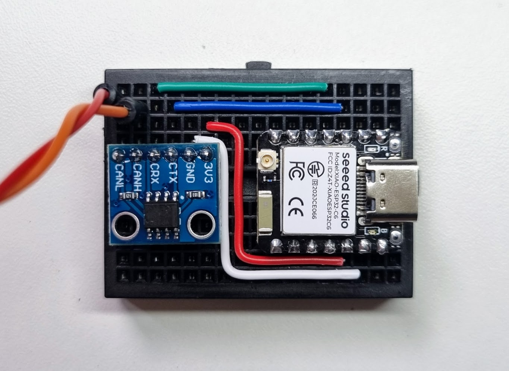

# Can Sender

Simple can sender using serial communication to replay a SavvyCan log file to your can network using a python script.

It will automatically adjust the transmission speed to reproduce the original log speed according to timestamps.

## How to use

Just save your log captured using SavvyCan and run this script.

```bash
# default params
python3 replay_log.py -l /data/log.csv -p /dev/ttyUSB0
```

Tip: dont forget to set the correct can bus speed and correct pins of your hardware in [main.cpp](/src/main.cpp)

## Hardware

I've used these boards, but its compatible with lot of other, you can see at [collin80/esp32_can](https://github.com/collin80/esp32_can) lib used.

 - Seed studio xiao esp32 c6 
 - SN65HVD230 can transceiver


